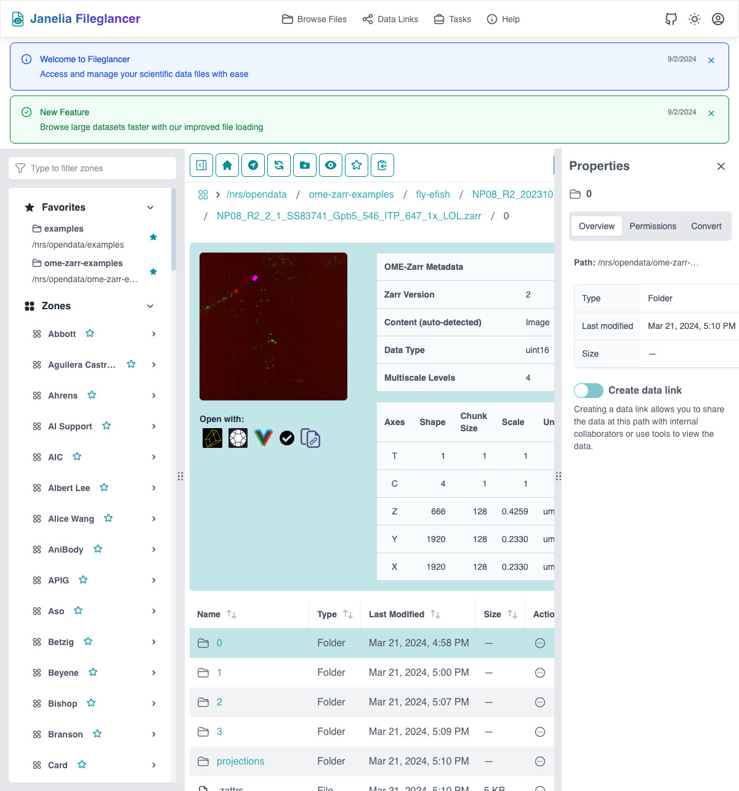
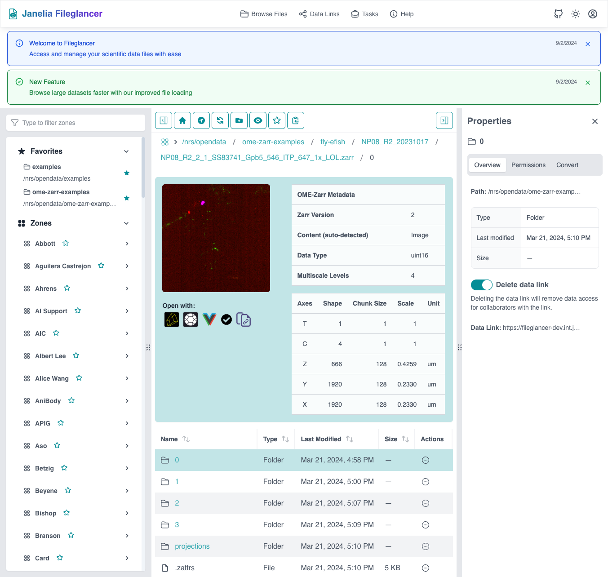
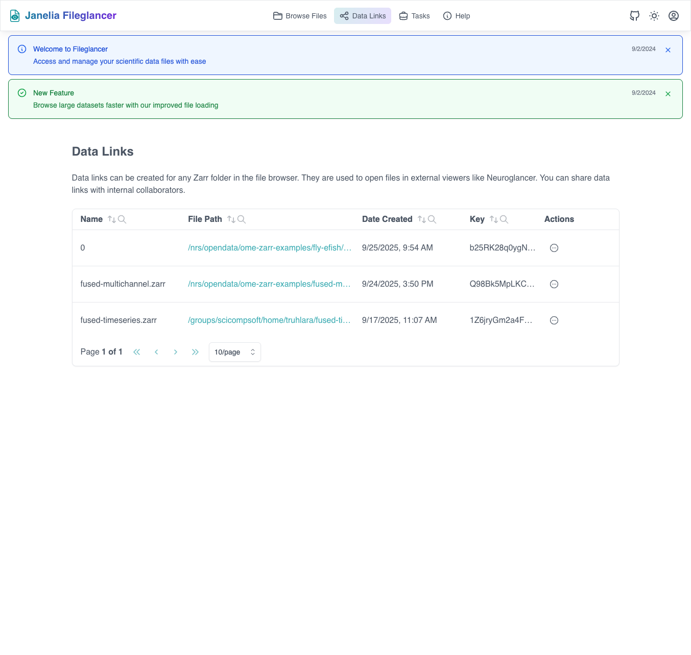

## Overview

Data links in Fileglancer allow you to create shareable URLs for your scientific imaging data without moving or copying files. These links provide controlled access to your datasets while maintaining security and proper permissions.

## Understanding Data Links

### What are Data Links?
- **Persistent URLs**: Stable web addresses that point to your data
- **Access controlled**: Respect existing POSIX file permissions
- **No data movement**: Links point to data in original locations
- **Shareable**: Can be sent to collaborators with appropriate access
- **Trackable**: Monitor who accesses your shared data

### When to Use Data Links
- Sharing datasets with collaborators
- Providing access to data for publications
- Creating bookmarks for frequently accessed data
- Integrating with external analysis tools
- Generating stable references for documentation

## Creating Data Links for Zarr/OME-Zarr Files

Zarr and OME-Zarr files have special integration features for data links:

*Viewing an OME-Zarr file in Fileglancer with metadata display and properties panel*

### Method 1: Properties Panel (Recommended)

1. **Navigate to your Zarr directory**
   - Use any navigation method to reach the folder containing your Zarr or OME-Zarr data
   - Ensure you're at the directory level, not inside the Zarr structure

2. **Open the Properties Panel**
   - The Properties Panel typically appears on the right side of the interface
   - If not visible, look for a "Properties" button or panel toggle

3. **Locate the Overview tab**
   - Click on the "Overview" tab within the Properties Panel
   - This tab shows general information about the selected directory

4. **Enable the data link**
   - Find the data link toggle switch
   - Click the switch to enable link creation
   - The switch will change state to indicate the link is active

5. **Copy the generated link**
   - Once enabled, a shareable URL will be generated
   - Copy this URL to share with others
   - The link will remain active until you disable it

*Successful data link creation showing the generated URL and external viewer integration options*

### Method 2: Tool Icon Dialog

1. **Navigate to your Zarr directory**
   - Browse to the target Zarr or OME-Zarr directory

2. **Click the tool icon**
   - Look for a tool or gear icon near the directory name or in the toolbar
   - This opens the data link creation dialog

3. **Review the link creation dialog**
   - The dialog shows information about the link being created
   - Review any permissions or access settings

4. **Approve the link creation**
   - Click "Approve," "Create Link," or similar confirmation button
   - The dialog may offer additional options

5. **Enable automatic links (optional)**
   - The dialog may offer to enable automatic link creation for similar future actions
   - Choose this option to streamline future link creation

6. **Copy the generated link**
   - The dialog or interface will display the new link
   - Copy and share as needed

## Creating Data Links for Any Directory

You can create data links for any directory, not just Zarr files:

### Standard Directory Linking Process

1. **Navigate to the target directory**
   - Use any navigation method to reach the desired folder
   - This can be any directory you have appropriate permissions for

2. **Open the Properties Panel**
   - Ensure the Properties Panel is visible
   - Usually located on the right side of the interface

3. **Access the Overview tab**
   - Click on the "Overview" tab within the Properties Panel
   - This shows general directory information and controls

4. **Enable directory sharing**
   - Find the data link toggle switch in the Overview tab
   - Click the switch to enable sharing for this directory
   - The switch indicates whether sharing is active

5. **Use the generated link**
   - Copy the generated URL for sharing
   - The link provides access to browse the directory contents

## Managing Your Data Links

### Viewing All Data Links

1. **Navigate to the links page**
   - Go to `/links` in your browser (add this to the base Fileglancer URL)
   - Example: `fileglancer.int.janelia.org/links`

2. **Review your active links**
   - See all currently active data links
   - View creation dates and access statistics
   - Monitor link usage and performance

*The Data Links page showing all created data links with management options*

### Disabling Data Links

1. **Navigate to the linked directory**
   - Use navigation to return to the directory with an active link

2. **Open Properties Panel**
   - Access the Overview tab as before

3. **Disable the link**
   - Click the toggle switch to turn off the data link
   - The link will immediately become inactive

4. **Confirm on the links page**
   - Check `/links` to verify the link has been removed

## Advanced Data Link Features

### Automatic Link Creation

When creating links through the tool icon dialog:

1. **Enable automatic creation**
   - Choose the option to enable automatic links during the approval process
   - This applies to similar directories or file types

2. **Benefits of automatic creation**
   - Streamlines repeated link creation tasks
   - Maintains consistency in sharing patterns
   - Reduces clicks for common workflows

3. **Managing automatic settings**
   - Review and modify automatic link settings in your profile
   - Disable automatic creation if you prefer manual control

### Permission Integration

Data links respect your existing file permissions:

1. **POSIX permissions apply**
   - Users accessing your links must have appropriate file system permissions
   - Links don't override existing access controls

2. **Group access**
   - Links work with group-based permissions
   - Share links with lab members who already have group access

3. **Permission troubleshooting**
   - If collaborators can't access links, check their file system permissions
   - Contact system administrators for permission adjustments

## Best Practices for Data Links

### Organizing Your Links

1. **Use descriptive directory names**
   - Clear folder names make links more useful
   - Consider renaming directories before creating links

2. **Create links at appropriate levels**
   - Link to project directories rather than individual files when possible
   - Balance between specificity and usefulness

3. **Regular maintenance**
   - Review your links periodically on the `/links` page
   - Disable links for completed projects or outdated data

### Sharing Links Effectively

1. **Provide context**
   - Include descriptions when sharing links
   - Explain what data the link contains and its purpose

2. **Verify access**
   - Test links with collaborators to ensure they work
   - Confirm collaborators have necessary permissions

3. **Document important links**
   - Save important links in lab documentation
   - Include links in publication supplementary materials

### Security Considerations

1. **Understand access scope**
   - Links provide access to directory contents
   - Be aware of what data is included in shared directories

2. **Monitor link usage**
   - Regularly check the `/links` page for usage patterns
   - Disable links that are no longer needed

3. **Coordinate with IT policies**
   - Ensure link sharing complies with institutional data policies
   - Consult with data management staff for sensitive datasets

## Integration with Other Features

### Neuroglancer Integration

For compatible datasets:

1. **Create data links first**
   - Enable data links for Zarr/OME-Zarr directories
   - Ensure the data is accessible via the link

2. **Open in Neuroglancer**
   - Use Neuroglancer integration features to open linked data
   - Share both the data link and Neuroglancer visualization

### File Conversion Workflow

Coordinate links with file conversions:

1. **Link original data**
   - Create links for source data before requesting conversions

2. **Link converted data**
   - Create new links for converted datasets when processing completes
   - Update collaborators with new links to converted formats

## Troubleshooting Data Links

### Link Creation Issues

**Problem**: Toggle switch doesn't respond
- Solution: Verify you have write permissions for the directory
- Check if you're authenticated properly
- Try refreshing the browser

**Problem**: Properties Panel not visible
- Solution: Look for panel toggle buttons in the interface
- Check if the panel is collapsed or minimized
- Try different browser window sizes

### Link Access Issues

**Problem**: Collaborators can't access links
- Solution: Verify collaborators have file system permissions
- Check if they're on the correct network (Janelia internal)
- Confirm the link is still active on your `/links` page

**Problem**: Links stop working
- Solution: Check if the data has been moved or permissions changed
- Verify the link wasn't accidentally disabled
- Contact system administrators for file system issues

### Performance Issues

**Problem**: Slow link generation
- Solution: Large directories may take time to process
- Check network connectivity
- Consider linking to smaller, more specific subdirectories

Remember that data links are a powerful feature for collaboration, but they should be used thoughtfully with consideration for security, permissions, and data management best practices.