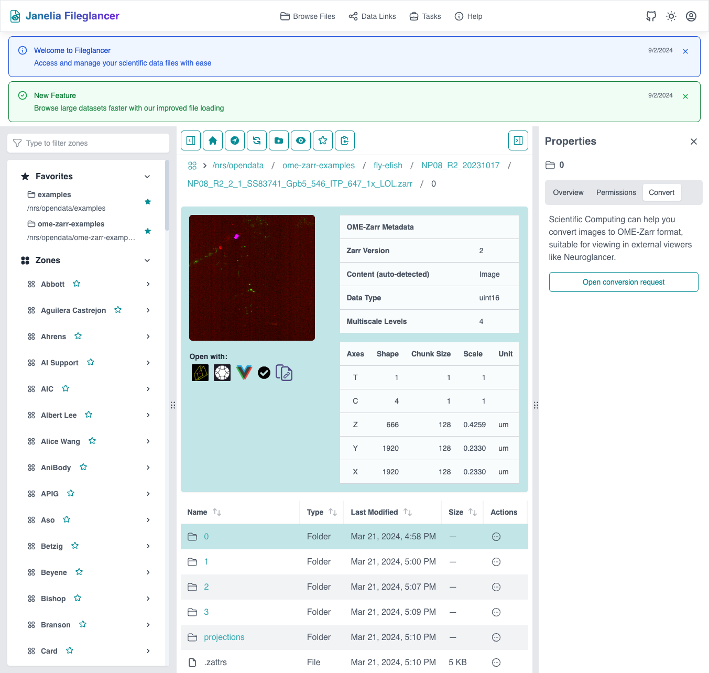
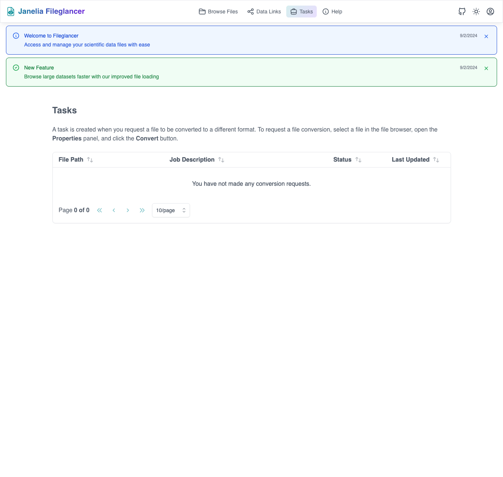

## Overview

Fileglancer integrates with Janelia's JIRA help desk system to handle manual data conversions. This feature allows you to request assistance converting your scientific imaging data between different formats.

## Supported Source Formats

Fileglancer conversion requests typically support:

- **Zarr arrays**: Existing Zarr datasets that need reformatting
- **OME-Zarr**: Conversion between OME-Zarr versions or structures
- **TIFF files**: TIFF data conversion to OME-Zarr format
- **OME-TIFF**: Metadata-rich TIFF conversions

## Requesting File Conversions

### Prerequisites

Before requesting a conversion:

1. **Verify source data accessibility**
   - Ensure you can navigate to and view the source data in Fileglancer
   - Confirm the data is complete and not corrupted
   - Check that you have read permissions for the source data

2. **Determine target format requirements**
   - Know what format you need for your analysis workflow
   - Understand any specific parameters or options required
   - Consider where the converted data should be stored

3. **Prepare conversion details**
   - Document any special requirements or constraints
   - Note any metadata that must be preserved

### Step-by-Step Conversion Request

#### For Zarr and OME-Zarr Data

1. **Navigate to your Zarr directory**
   - Use any navigation method to reach the Zarr or OME-Zarr directory
   - Ensure you're at the correct directory level containing the data

2. **Open the Properties Panel**
   - Locate the Properties Panel on the right side
   - If not visible, look for the expand Properties button in the browser toolbar, on the right

3. **Switch to the Conversion tab**
   - Click on the "Conversion" tab within the Properties Panel
   - This tab contains conversion-specific tools and information

*The Convert tab in the Properties Panel showing conversion request options*

5. **Open the conversion request**
   - Click the button or link to "Open conversion request"
   - This will open a dialog

6. **Complete the dialog**
   - Fill out the dialog with required information
   - Include details about:
     - Target location for converted data

7. **Submit your request**
   - Submit the dialog
   - View the information about the ticket now populated in the Properties panel

## Tracking Your Conversion Requests

### Using the Jobs Page

1. **Navigate to the jobs page**
   - Go to `/jobs` in your browser

*The Tasks page showing conversion request status and history*

2. **View your requests**
   - See all current conversion requests and their status
   - Monitor progress through different conversion stages

3. **Check status updates**
   - Track when requests are received, in progress, or completed

### Status Meanings

Understanding conversion request statuses:

- **Submitted**: Request received and queued for processing
- **In Review**: Technical staff reviewing the request details
- **In Progress**: Conversion actively being performed
- **Completed**: Conversion finished and data available
- **On Hold**: Waiting for additional information or clarification
- **Failed**: Conversion encountered errors (details provided)

### Accessing Converted Data

1. **Check completion notification**
   - Monitor the `/jobs` page for completion status
   - Look for email notifications

2. **Locate converted data**
   - Navigate to the specified output directory
   - Verify the converted data is accessible

3. **Validate conversion results**
   - Check that the converted data opens properly in your analysis tools
   - Verify metadata preservation
   - Compare file sizes and structure as expected

## Troubleshooting Conversion Issues

### Common Request Problems

**Problem**: Conversion request form won't submit
- Solution: Check that all required fields are completed
- Verify you're still authenticated to the system
- Try using a different browser if issues persist

**Problem**: Can't find the Conversion tab
- Solution: Ensure you're navigating to Zarr or OME-Zarr directories
- Check that the Properties Panel is fully expanded
- Verify you have appropriate permissions for the directory

### Conversion Process Issues

**Problem**: Conversion failed or produced unexpected results
- Solution: Contact technical staff through the help desk system
- Provide specific details about what you expected vs. what occurred
- Include sample files or detailed error descriptions

**Problem**: Converted data is missing metadata
- Solution: Review your original conversion request for metadata requirements
- Contact technical staff to clarify metadata preservation options
- Consider requesting a re-conversion with specific metadata instructions

**Problem**: Conversion taking longer than expected
- Solution: Check the jobs page for status updates
- Contact technical staff if no progress updates are visible
- Consider if the dataset size or complexity requires additional processing time

The file conversion system in Fileglancer provides professional data conversion services while maintaining the integrity and accessibility of your scientific imaging data. Use it as a reliable way to prepare your data for analysis, sharing, and long-term preservation.