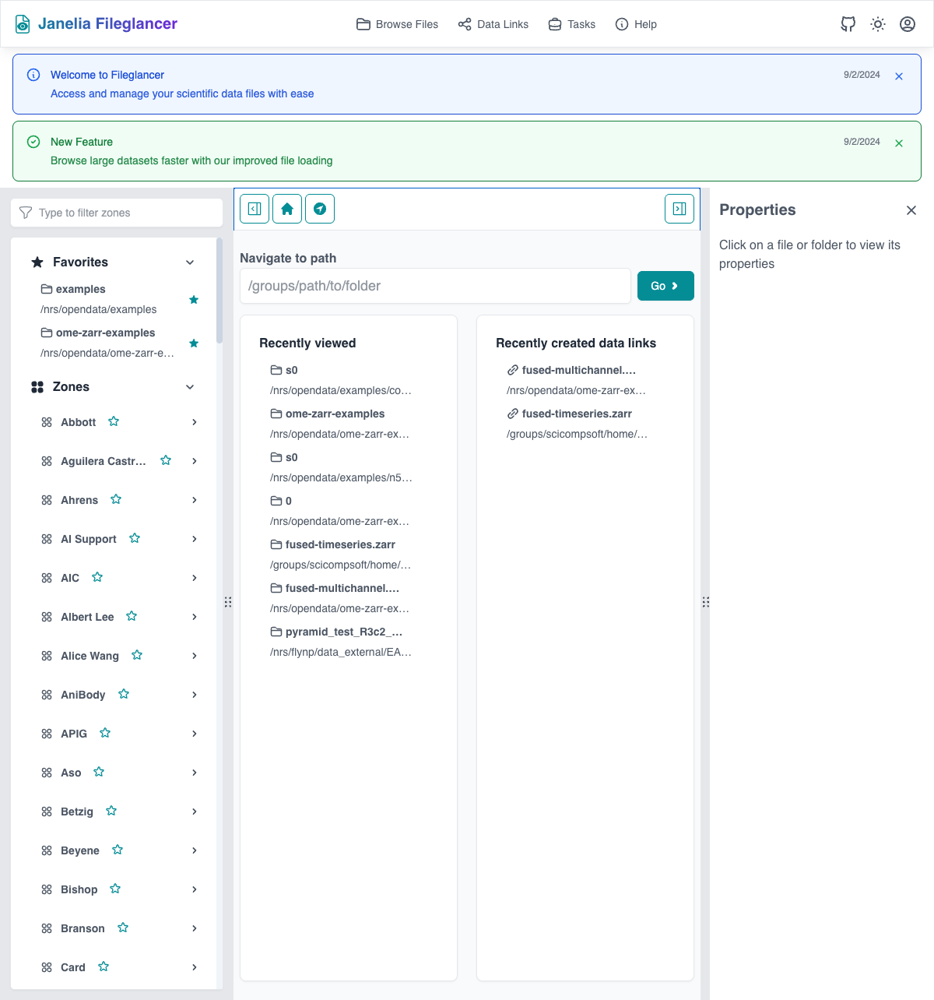

## Overview

Fileglancer provides multiple powerful methods to navigate your scientific imaging data across Janelia's file systems. This guide covers all navigation features, from basic browsing to advanced organizational techniques.

*The Fileglancer main interface showing the left sidebar with zones, file share paths, and navigation options*

## Primary Navigation Methods

### 1. Search and Browse Method (Recommended)

This is the most efficient way to access your data:

1. **Open the search interface**
   - Locate the search box in the left sidebar
   - The sidebar remains accessible throughout your session

2. **Search for your zone or file share path**
   - Type the name of your zone (e.g., "smithlab", "flylight")
   - Type partial file share path names
   - Search results update as you type

3. **Select your file share path**
   - Click on the file share path from the search results
   - This opens the file browser interface for that location

4. **Browse your data**
   - Use the main file browser to navigate through directories
   - Click folder icons to enter directories
   - Use the breadcrumb trail to navigate back up the hierarchy

### 2. Direct Path Navigation

For when you know exactly where you want to go:

1. **Locate the "Navigate to path" widget**
   - Found in the main toolbar area
   - Usually displayed as a path input field

2. **Enter your complete file path**
   - Paste or type the full path to your target directory
   - Example: `/groups/smithlab/experiments/2024/imaging-data`

3. **Navigate to the path**
   - Press Enter or click the navigation button
   - Fileglancer will take you directly to that location

### 3. Home Directory Access

Quick access to your personal directory:

1. **Click the home icon**
   - Located in the main toolbar
   - Usually appears as a house symbol

2. **Access your home directory**
   - Takes you directly to your personal home directory on the Janelia file system
   - Useful for accessing personal data and settings

## Organizing Your Navigation

### Saving File Share Path Favorites

For frequently accessed zones and file shares:

1. **Search and find your file share path**
   - Use the search method described above
   - Locate the file share path you access regularly

2. **Save as favorite**
   - Right-click on the file share path (platform-dependent)
   - Or look for a star/bookmark icon near the path
   - Select "Add to favorites" or similar option

3. **Access saved favorites**
   - Saved file share paths appear in the left sidebar
   - Click any favorite for immediate access
   - Favorites persist across sessions

### Saving Folder Favorites

For specific directories you visit often:

1. **Navigate to your target folder**
   - Use any navigation method to reach the desired directory
   - Ensure you're in the exact folder you want to bookmark

2. **Save the folder location**
   - Click the star icon in the main toolbar
   - The icon may change state to indicate the folder is saved

3. **Access folder favorites**
   - Saved folders appear in the left sidebar under favorites
   - Organized separately from file share path favorites
   - Click any favorite for direct access

## Advanced Navigation Features

### Breadcrumb Navigation

Efficiently move through directory hierarchies:

1. **View the breadcrumb trail**
   - Located above the main file browser area
   - Shows your current path as clickable segments

2. **Navigate up levels**
   - Click any segment in the breadcrumb trail
   - Jump directly to that directory level
   - Useful for backing out of deep folder structures

### Multi-System Navigation

Janelia Research Campus provides multiple storage systems optimized for different data lifecycle stages:

1. **PRFS (Primary Research File System)**
   - **Purpose**: High-performance storage for active research data and analysis
   - **Performance**: Fastest access times, optimized for frequent read/write operations
   - **Capacity**: Limited storage quota per lab/project
   - **Best for**: Current experiments, active analysis, frequently accessed datasets
   - **Access patterns**: Search for your lab's primary zones (e.g., `/groups/labname/`)
   - **Typical paths**: `/groups/`, `/nrs/` (high-performance tier)

2. **NRS (Non-Recoverable Storage)**
   - **Purpose**: Cost-effective storage for large datasets that don't require backup
   - **Performance**: Good throughput for large file operations, moderate latency
   - **Capacity**: Larger storage quotas compared to PRFS
   - **Best for**: Raw microscopy data, intermediate processing results, reproducible datasets
   - **Access patterns**: Search using `/nrs/` path prefixes
   - **Data policy**: No backup - suitable for reproducible or intermediate data

3. **Nearline Storage Systems**
   - **Purpose**: Long-term archival storage with retrieval capabilities
   - **Performance**: Slower access times, optimized for infrequent access
   - **Capacity**: Very large storage capacity at lower cost
   - **Best for**: Completed project archives, reference datasets, compliance storage
   - **Access patterns**: May require pre-staging for optimal performance
   - **Retrieval**: Some data may need time to come online before access

## Navigation Best Practices

### Efficient Search Strategies

- **Use specific zone names**: More specific searches return faster results
- **Start with partial matches**: Type the beginning of your zone name for quick results
- **Use file share names**: Search for the actual share name rather than full paths

### Organizing Favorites Effectively

1. **Create a hierarchy of favorites**
   - Save file share paths for general access
   - Save specific folders for project work
   - Use descriptive names when possible

2. **Regular maintenance**
   - Remove outdated favorites periodically
   - Update favorites when project directories change
   - Keep the list manageable (10-20 favorites maximum)

### Working with Large Directory Structures

1. **Use the path navigation widget**
   - More efficient than clicking through many levels
   - Paste paths from other sources (emails, documents)

2. **Leverage breadcrumbs**
   - Faster than using the back button repeatedly
   - Jump directly to any parent directory

3. **Create intermediate favorites**
   - Save favorites at meaningful project levels
   - Don't just save the deepest directories

## Troubleshooting Navigation Issues

### Path Not Found
- Verify you have correct permissions for the target directory
- Check if the path exists and hasn't been moved
- Ensure you're connected to the correct network

### Search Returns No Results
- Try broader search terms
- Verify the zone or share name spelling
- Check if the file share is currently mounted

### Slow Loading
- **PRFS**: Fastest loading times, optimal for frequent access
- **NRS**: Moderate loading times, good for large file operations
- **Nearline**: Slower access, some files may need staging time
- Large directories (>1000 files) may take time to populate regardless of storage system
- Consider using more specific navigation paths to reduce directory listing overhead

### Favorites Not Saving
- Ensure you have write permissions to your profile
- Check if you're properly authenticated
- Try refreshing the browser and re-adding favorites

## Integration with Other Features

### Navigation and Data Links
- Navigate to specific directories before creating data links
- Use favorites to quickly access commonly shared folders
- The current navigation location affects link creation scope

### Navigation and File Conversions
- Navigate to the exact Zarr/OME-Zarr directory for conversions
- Use breadcrumbs to verify you're at the correct level
- Folder favorites help track conversion source locations

### Navigation and Permissions
- Your navigation access depends on POSIX permissions
- Some directories may be visible but not accessible
- Navigation helps identify permission boundary issues

## Keyboard Shortcuts

Common shortcuts that work in most browsers:

- **Ctrl/Cmd + L**: Focus on address/path bar
- **Alt + Left Arrow**: Browser back button
- **Alt + Right Arrow**: Browser forward button
- **Ctrl/Cmd + R**: Refresh current directory view
- **Ctrl/Cmd + D**: May bookmark current location (browser-dependent)

Remember that Fileglancer runs in your web browser, so standard browser navigation shortcuts often work alongside the application-specific features.